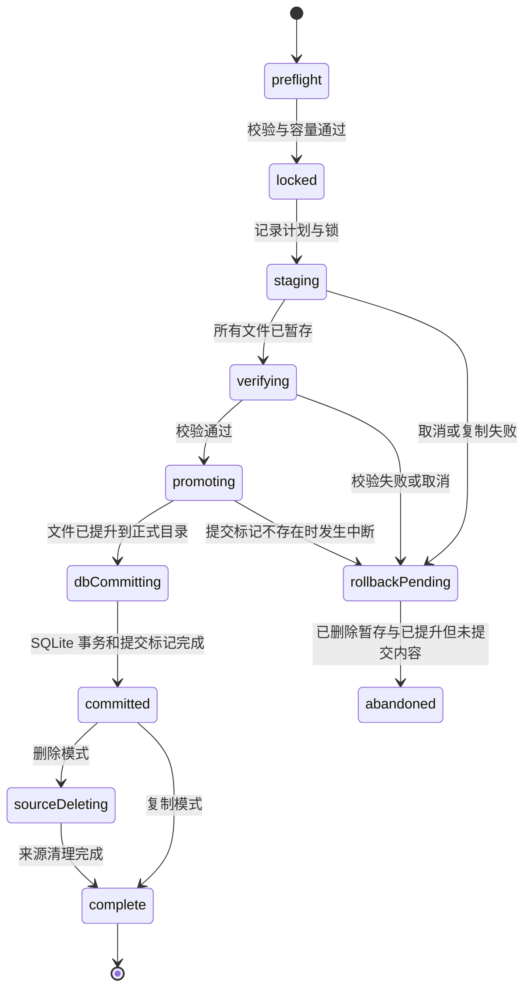

# FRKB 库合并功能草案

创建日期：2026-07-12

状态：实现草案；核心链路已落地，仍作为后续审计与扩展依据。

## 1. 目标与已确定的交互

在当前正在使用的 FRKB 库中，导入另一个 FRKB 库，使当前库成为合并后的唯一工作库。
用户不需要选择“目标库”：当前库永远是目标库，只选择来源库。

用户已经明确的产品规则：

- 仅支持 **FRKB 库 → FRKB 库**，不涉及 Rekordbox 数据库。
- 选择来源库后，让用户选择：`复制并合并` 或 `合并后删除来源库`。
- 不展示曲目/歌单差异预览，不要求用户逐项处理冲突。
- 普通歌单同名时不覆盖、不合并内容；来源歌单自动改名为
  `原歌单名 (from 来源库名)`，仍重名则追加序号。
- 合并期间用户不能做其他操作；界面应提供清晰、可信、可理解的进度反馈。
- 开始写入前必须计算目标磁盘容量；容量不足时不得开始。
- 应用崩溃、强制退出、断电、来源盘断开时，不能损坏当前库，也不能误删来源库。

本文将“没有数据字段冲突”理解为：同一首歌在两库中的业务字段不需要让用户选择胜负。
这不等于实现上没有冲突：FRKB 的树节点 UUID、相对路径、曲目分析记录、Set/Mixtape 关联记录都
需要重映射，不能直接复制 SQLite 文件或覆盖目录。

## 2. 结论先行

这个功能可做，但应命名为 **“合并 FRKB 库”**，实现为一个可恢复的导入任务，而不是
“把来源目录复制到当前目录”。

推荐的核心设计是：

```text
选择来源库
  → 只读预检并计算空间
  → 用户选择保留或删除来源库
  → 锁定当前库与界面，建立任务日志
  → 复制到当前库内部的隐藏暂存区
  → 校验并将暂存内容提升到正式目录
  → 单次 SQLite 事务写入节点与分析数据
  → （删除模式）成功提交后才清理来源库
  → 写入完成记录，解除锁定
```

关键约束如下：

1. 目标库在 **数据库事务提交前** 不写入正式 SQLite 数据；失败时可删除暂存内容，当前库仍
   保持合并前状态。
2. 文件提升到正式目录和 SQLite 提交之间的短暂窗口由持久化任务日志覆盖；下次启动可以判断
   是回滚未提交内容还是完成已提交任务。
3. `合并后删除来源库` 不是“边复制边删除”。它与复制模式使用相同的空间预算；只有目标库
   已保存、校验、写入提交标记后，才可开始删除来源库。
4. 来源库中任何未被明确支持的数据类型都不能悄悄跳过。首版应拒绝开始并说明原因，而不是
   交付一个表面成功、实际丢失项目数据的合并。

## 3. 名词与边界

| 名词 | 含义 |
| --- | --- |
| 当前库 / 目标库 | `store.databaseDir` 指向、正在运行的 FRKB 库根目录。 |
| 来源库 | 用户选择的 `FRKB.database.frkbdb` 所在根目录。 |
| 普通歌单 | `FilterLibrary`、`CuratedLibrary` 中的 `songList` 叶节点及其音频文件。 |
| 目录节点 | 普通歌单上层的 `dir` 节点；同名目录可以合并树结构。 |
| 暂存区 | 目标根目录下的隐藏目录 `.frkb-merge/<任务 UUID>/`，不在 `library/` 中，因此不会被正常扫描、播放或导出。 |
| 提交点 | 目标 SQLite 事务完成并写入该任务的 `dbCommitted` 标记的时刻。此后目标合并不可自动回滚。 |
| 删除来源 | 对来源库根目录进行清理；不放入“当前库的曲目回收站”，因为该回收站不适用于一个完整库根目录。 |

来源库的可读标识取其根目录名，例如 `D:/FRKB_database-B` 显示为 `FRKB_database-B`。它只用
于歌单后缀和界面文案；内部任务识别使用来源 manifest 的 UUID，不能仅依赖目录名。

## 4. 用户流程

### 4.1 入口和选择来源

在标题栏的 **“迁移”菜单** 中提供“合并 FRKB 库”。它属于库结构与数据迁移，不应放在普通
导入、文件操作或歌单菜单中。点击后先打开跨平台合并向导，说明合并范围、安全机制和来源库处理
方式；用户确认设置后才打开系统文件选择器，筛选并只接受 `FRKB.database.frkbdb`。

“迁移”菜单的入口规则：

- 当前库尚未打开、当前库处于恢复锁定状态或已有合并任务时，菜单项禁用。
- 任务从“锁定”阶段开始直到完成/安全取消前，整个“迁移”菜单禁用，避免启动库切换、旧库迁移或
  其他会写入当前库的流程。
- 发现未完成合并任务时，入口文案改为“继续未完成的库合并”，直接进入恢复界面；不允许再发起一个
  新的合并任务。

选择后立即做轻量校验，以下情况直接拒绝：

- 选择的 manifest 无效，或不是 FRKB 根目录。
- 选择的是当前库。
- 当前库位于来源库内部，或来源库位于当前库内部，避免递归复制。
- 来源 manifest 的最低应用版本高于当前 FRKB，或 manifest 格式高于当前程序可识别的版本。
- 来源 SQLite 不存在、无法只读打开，或 `PRAGMA integrity_check` / 外键检查失败。
- 来源 SQLite schema 高于当前库时拒绝开始；schema 较旧但库树结构已经可验证时，先创建 SQLite
  一致性备份到目标库临时工作区，并只在该副本上运行正式 schema 迁移。来源 SQLite、媒体文件和
  manifest 都不修改；极老旧、缺少可验证库树的结构仍明确拒绝，而不是猜测重建。
- 目标已有未完成的合并任务、活动合并锁，或来源中存在未支持的数据类型。
- 存在任何已打开的 Mixtape 窗口。主窗口的全屏进度层无法覆盖独立 Mixtape 窗口，而该窗口可能
  写入项目、item、cue、音量包络或 stem 状态；必须先关闭全部 Mixtape 窗口后才能开始合并。
- 当前库存在任何会写入数据库或库文件的运行中任务。包括但不限于：key / BPM / beat grid / 能量 /
  段落 / 波形分析，补全或编辑元数据，封面写入，指纹扫描与保存，导入/移动/转换/删除文件，Set /
  Mixtape 输出与 stem 任务，录音落盘，以及库树扫描同步。合并入口必须先检查任务注册表；存在任务时
  只提示“请等待任务完成或取消”，不能以暂停一部分任务来侥幸开始合并。
- 扫描到符号链接、junction/reparse point、FIFO 或其他无法证明边界安全的文件类型。

不得把选择器用于任意目录后“猜测”其是否像库；manifest 是唯一入口。

轻量校验通过后、显示模式确认前，再运行一次完整的 **合并可执行性预检**。这不是给用户看的
差异预览，而是一次必须全部通过的静态验证；只有它完成后才允许创建任务和写入第一个暂存文件。
在来源不被外部改变、磁盘/权限没有运行时故障的前提下，它应保证不会出现“复制到一半才发现目录
结构不对、节点引用无法重建”的可预见失败。

### 4.2 模式确认，不等于预览

预检确认来源有效且容量足够后，弹出一个很小的决策框：

- **复制并合并（推荐）**：保留来源库。
- **合并后删除来源库**：当前库安全提交后才删除来源库。

这里不显示歌单清单、冲突清单或曲目差异，符合“不展示预览”的要求。删除选项需要明确写出
“来源库会在合并成功后永久清理；不会在复制过程中删除”，并要求一次明确确认，防止用户把
“删除”理解为仅删除快捷入口。

如果预检发现空间不足，直接说明目标卷还缺少多少空间并停止；不进入模式确认，也不写入任何
文件。

### 4.3 专用、阻塞式进度界面

确认后显示专用的“正在合并 FRKB 库”模态层，而不是复用只适合短任务的普通 toast。它覆盖
主窗口，阻断菜单、快捷键、拖放、播放队列、歌单编辑、导入导出和设置修改。关闭窗口同样应
被拦截；应用只允许安全取消或等待任务结束。

界面至少包括：

- 当前阶段及一句人话说明，例如“正在复制音乐与分析数据”。
- 当前文件或当前歌单名；过长文本使用项目的 `bubbleBox`，不能使用原生 `title`。
- 当前阶段进度：扫描阶段可是不定进度，复制阶段应显示 `已复制 12.4 GB / 38.1 GB` 与
  `2,142 / 5,040 个文件`，校验阶段显示已校验的文件数。
- 可用时显示平滑的预计剩余时间；样本不足时只显示“正在估算”，不显示虚假的剩余时间。
- 当前版本不提供中途取消，以避免把“停止复制”误解为可安全中断。提交前若发生异常会按日志自动清理；
  提交点之后文案明确为“正在保存合并结果，请不要关闭 FRKB”。若以后增加取消，必须实现为持久化
  `cancelling` 状态加日志回滚，不能直接中止 Promise。

进度采用“阶段进度 + 实际单位”而非伪精确的全局百分比。扫描不把未知文件数硬映射为 0–100%；
复制按实际字节数；数据库提交和来源删除显示各自明确阶段。这样进度不会因某个大文件或数据库
写入而长期停在一个误导性的百分比上。

新增 Renderer UI 必须同时检查浅色与深色主题；波形区域不在本功能范围内。所有说明和截断文本
仍遵循现有 `bubbleBox` 约束。

### 4.4 结束状态

完成页只报告结果，不在开始前展示预览：

- 已导入普通歌单数、已自动改名数、复制文件数和总字节数。
- 已迁移的可保留曲目分析数据数；封面、波形和 stem 等可重建缓存不从来源导入。
- 若选择删除模式：来源库已删除；或“目标合并已成功，但来源库清理未完成”，并给出可继续清理
  的入口和精确错误原因。

“目标合并成功、来源删除失败”是部分成功，不是合并失败。绝不能为了让状态看起来整齐而回滚
已经成功且用户本来要求保留的目标库。

## 5. 合并语义

### 5.1 普通音乐库树

普通音乐库以 `FilterLibrary` 和 `CuratedLibrary` 为第一批支持范围。合并依据是库根下的相对
树路径，而不是 Windows 绝对路径。

规则：

1. 两边同名的中间目录（`dir`）合并为一个目录，来源的子项继续递归导入。
2. 来源普通歌单在目标父目录下无同名项时，保留原名。
3. 同一父目录下已有同名歌单时，来源歌单改为
   `名称 (from 来源库名)`；若仍同名，则为
   `名称 (from 来源库名 2)`、`名称 (from 来源库名 3)`，直到在目标文件系统和
   `library_nodes` 中都唯一。
4. 文件系统冲突判定必须与运行平台一致：Windows 按不区分大小写处理；macOS 要处理实际卷的
   大小写与 Unicode 规范化行为。不可在计划阶段判为不同、提升阶段才覆盖文件。
5. 目标既有项目永远排在前面；来源同级项目按来源原有 `sort_order` 追加，保留来源内部顺序。
6. 来源曲目一律按其来源歌单树复制。**首版不做跨库曲目去重**，也不因为哈希、文件名或元数据
   相同而合并两首歌；这符合“没有字段冲突、只处理歌单同名”的产品设定，也避免悄悄改变来源
   的歌单内容。

示例：

```text
当前：library/FilterLibrary/House/Favorites
来源：library/FilterLibrary/House/Favorites

结果：library/FilterLibrary/House/Favorites
      library/FilterLibrary/House/Favorites (from FRKB_database-B)
```

如果来源的叶节点与目标的中间目录同名，或来源目录与目标歌单同名，不应凭猜测覆盖或拼接。计划
阶段把来源节点重命名为同样的 `(from …)` 形式，再导入其整个子树，并在最终结果中计为自动改名。

### 5.2 UUID、路径和分析数据

即使文件名完全不冲突，也不能复用来源 `library_nodes.uuid`：来源库可能由当前库复制而来，UUID
会重复；而 Set、Mixtape 等表以 UUID 做外键。

合并计划必须先建立不可变映射：

```text
source node UUID         -> target node UUID
source relative list root -> target relative list root
source relative file path -> target relative file path
source absolute file path -> target absolute file path
```

普通节点使用新 UUID；目标根节点和六个核心库节点映射到目标既有节点，不复制来源根/核心库 UUID。
所有 SQLite 写入只使用这份映射，禁止使用字符串替换绝对路径。

当前数据库的可迁移数据可分为三类：

| 类别 | 处理方式 |
| --- | --- |
| 业务数据 | `library_nodes`、普通歌单文件、`fingerprints`。节点重建、文件复制；指纹按 `(mode, hash)` 做并集。 |
| 可验证的曲目分析 | `song_cache` 的 `info_json`（含 key、BPM、网格、cue、能量、段落等）。按映射重写 `info_json.filePath`，只在目标文件实际 size/mtime 可匹配时写入。虽然表名带 `cache`，其内容属于用户可见的持久业务数据。 |
| 可丢弃缓存 | 封面索引和 `.frkb_covers`、所有波形/显示波形缓存、stem 缓存和 `.frkb_cache`、外接 Rekordbox/USB 设备绑定的 `external_analysis_*`。它们一律不从来源复制，也不计入容量；当前库按需重新建立。 |

复制时应请求保留文件时间戳；复制结束后仍以目标实际 `stat` 写回曲目分析记录中的 `size` /
`mtime_ms`。封面、波形和 stem 缓存没有迁移入口，因此不会留下指向来源路径或永远不会命中的条目。

`meta` 属于目标库自身状态，默认不从来源覆盖；只有在“数据参与者注册表”中显式声明的键才可按其
自身语义合并。当前 `curated_artist_library_v1`（精选艺人）会按规范化艺人名合并次数，并对关联
曲目指纹取并集。来源 manifest、来源 SQLite 文件、WAL/SHM 文件和旧版 `songFingerprint` 文件均不
直接复制；必须从已验证的数据读取后重建目标状态。

为了防止后续 schema 新增表时漏搬数据，合并实现维护“数据参与者注册表”：每张表必须显式标记为
`metadata`、`union`、`node-tree`、`analysis-remap`、`row-transform` 或 `discardable`；`meta` 的每个
可合并键也必须在该注册表中声明合并函数。新增功能只需由数据所有者新增一个参与者，而不用改合并
事务主流程。发现未知业务表时默认失败；不能默认跳过。

### 5.3 Set、Mixtape、录音库与回收站：不能假装没有它们

当前 FRKB 还存在 `SetLibrary`、`MixtapeLibrary`、`RecordingLibrary` 和 `RecycleBin`。其中 Set 与
Mixtape 不只是普通歌单目录：它们涉及 `set_items`、`mixtape_items`、项目设置、stem 资产和来源
路径快照。它们不构成“用户字段冲突”，但确实构成引用迁移问题。

当前实现的完整边界如下：

| 内容 | 合并策略 |
| --- | --- |
| Filter / Curated 普通歌单 | 复制歌单文件，重建节点 UUID，迁移曲目分析结果与指纹；封面/波形缓存不导入。 |
| Set 库 | 复制 `__set_custody__` 资源，重建 `setList` UUID 与 `set_items.id`，重写 item 文件路径、`origin_*` 和分析快照。 |
| Mixtape 库 | 复制 `.mixtape_vault` 资源，重建 `mixtapeList` UUID、item ID 与项目 UUID 引用，保留 item/project 业务 JSON、cue 与混音配置。Stem 的派生缓存和绝对路径状态明确失效，重建时从 `pending` 开始。 |
| Recording 库 | 复制库根下的录音文件；同名文件使用 `from 来源库名` 后缀，避免覆盖当前录音。 |
| RecycleBin | 不导入。已删除内容不应在合并时重新出现。 |

任何不属于上表、无法解释为库树节点或已登记隐藏资源目录的来源内容，一律在预检阶段拒绝，不能静默跳过。

## 6. 容量预检

### 6.1 预检要计算什么

用户不看预览，并不意味着可以不扫描。预检必须在写入前遍历来源中计划导入的常规库，统计：

- 待复制的每个常规文件、大小和路径；忽略 `.frkb.uuid`、旧 `.description.json` 等 FRKB 控制
  文件，目标会重建自己的标识。
- 需迁移的 SQLite 行与 BLOB 的字节上界，包含必要索引、页面增长和任务日志。
- 目标根目录所在卷的实际可用空间；若暂存区和目标库不在同一卷，还要分别计算。
- 来源和目标是否在同一卷。即使选择“合并后删除来源库”，来源空间也不能预先算作可用空间。

建议使用目标根目录所在卷的 `statfs` / 平台等价 API。无法可靠得到可用空间（例如某些网络共享
或权限受限卷）时，首版应拒绝开始并说明“无法验证目标磁盘可用空间”，而不是赌一次复制会成功。

### 6.2 峰值空间公式

暂存区放在目标根目录，以便同卷 `rename` 到正式目录，避免二次复制媒体文件。目标卷需要的最小
可用空间为：

```text
需要空间 = 待导入媒体与同目录资源字节数
         + 目标 SQLite 增量上界（数据、索引、WAL）
         + 来源 SQLite 隔离升级快照及迁移峰值（仅来源 schema 较旧时）
         + 持久化任务日志与映射数据上界
         + 安全余量

安全余量 = max(2 GiB, 前四项之和 × 15%)
```

SQLite 增量不能只按最终 `FRKB.database.sqlite` 可能增长的大小粗估。`D` 必须同时包含最终数据库
页增长、索引增长、最大 WAL 文件和 SQLite 临时页；checkpoint 把 WAL 写回主库时，两者可能短暂
同时存在。当前实现以来源库的 SQLite 逻辑页大小 `L = page_size × page_count` 为保守上界，使用
`D = max(64 MiB, 2 × L + 16 MiB)`：一份覆盖转换后的数据/索引增长，另一份覆盖同一事务的 WAL
峰值。来源中未迁移的派生表只会让该估算更保守；宁可多报需求，不可在写入中才发现空间不够。

删除模式的峰值和复制模式相同：提交前来源必须完整保留，目标暂存区也必须完整存在。只有来源
和目标都处于同一卷时，删除完成后才会释放该卷的旧空间；这与是否能开始没有关系。

设 `P` 为计划复制到目标的媒体及同目录资源总字节数，`D` 为目标 SQLite 数据、索引和 WAL 的
保守增量上界，`U` 为来源 SQLite 隔离升级快照与迁移峰值（schema 已一致时为 0），`J` 为任务
日志/路径映射上界，`H` 为安全余量，则各阶段的目标卷新增占用为：

| 阶段 | 新增占用上界 | 说明 |
| --- | --- | --- |
| 完整预检 | 近似 `J`；旧 schema 时另加 `U` | 计划先在内存生成；旧 schema 只在隔离 SQLite 快照中升级，预检结束立即清理。 |
| 暂存复制 | `P + J` | 每个来源文件只写一个目标 `.part` / 暂存文件；流式 hash 不会再复制一份。 |
| 同卷提升 | `P + J` | 暂存区在目标根目录，使用 rename 移到正式目录，物理媒体不重复占用。预检必须确认两者同卷。 |
| SQLite 提交 | **`P + D + U + J + H`** | WAL、索引页、曲目分析记录、来源升级快照与已经提升的媒体同时存在，这是开始合并必须预留的峰值。 |
| 提交后 / 来源删除 | 不高于前一阶段 | 之后只会 checkpoint、清理日志或删除来源；来源释放的空间不计入启动条件。 |

目标库原有大小 `T` 和来源库原有大小 `S` 都不应直接加到“额外需要空间”中：`T` 已经占用在目标
卷上，`S` 在来源卷上且提交前不可释放。若来源和目标恰好同卷，也仍只把上表的新增 `P + D + J + H`
与该卷当前可用空间比较，绝不能提前把将来可能释放的 `S` 算进去。

### 6.3 容量检查的失败处理

- 预检阶段空间不足：不创建任务目录，不改当前库，不弹出删除确认。
- 暂存过程中收到 `ENOSPC`：立即停止调度新的文件，保留日志以供“清理暂存并退出”或排障；不进
  入提交点，不碰来源库。
- 每复制一定字节数重新检查目标可用空间，提前发现其他程序占满磁盘的情况。
- 当前实现每开始复制一个文件都会按“尚未预留的媒体 + 数据库峰值 + 安全余量”复查目标卷；任务日志
  采用 copy-on-write 重写，因此日志预算按路径、hash、意图/完成记录及 `journal.json`/`.next` 同时存在的
  峰值计算，而不是只按文件数乘一个固定常量。
- 不因“来源库在同一硬盘，最终会被删掉”降低阈值。

## 7. 完整可执行性预检：把结构错误挡在开始前

“库完整性合法”不能只检查 manifest 存在。预检成功的含义是：合并服务已经能在内存中生成一份
完整、无歧义、可执行的 `MergePlan`，并且该计划的每个输入均已验证。它不是统计预览，不向用户
展示歌单差异；它是合并能否开始的硬门槛。

### 7.1 先让当前库静止，再做最终预检

为避免“检查时没有任务、检查后任务立刻开始”的竞态，开始按钮的处理顺序应固定为：

1. 进入临时 `preparingMerge` gate，立即拒绝新的库写入入口和新的后台任务。
2. 枚举任务协调器和所有子窗口；只要有一个可写任务、Mixtape 窗口或尚未 drain 的 watcher 回调，
   就解除临时 gate，提示用户完成/取消原任务后重试。
3. 暂停 watcher 与后台调度，确认当前 SQLite 没有未完成写事务；此时当前库的文件和数据库视图
   已静止。
   合并服务会在此时取得目标 SQLite 的 `BEGIN IMMEDIATE` 写锁并保持到最终提交；任何漏网的写入都
   无法与合并事务并发落库，而不是只依赖 Renderer 遮罩。
4. 在静止视图上完成来源验证、目标命名规划、数据转换验证和容量计算。
5. 计划全部通过后保留 gate，才显示保留/删除来源的模式确认；用户确认后将临时 gate 升级为持久
   合并锁并创建任务日志。任一步失败或用户取消则恢复 watcher、解除 gate，不留下任务目录。

这样，即使完整预检需要较长时间，也不会在它计算目标目录、曲目分析映射和容量时让当前库发生变化。

### 7.2 计划必须验证的项目

| 检查面 | 开始前必须成立的条件 |
| --- | --- |
| 来源根 | manifest 格式、UUID、版本兼容；SQLite 文件存在且只读可开；`integrity_check` 和 `foreign_key_check` 通过；schema 在明确支持范围内。 |
| 库树 | `library_nodes` 只有允许的 node type；根和核心库节点完整且唯一；每个 parent 下的名称/排序合法；无孤儿 UUID、循环、重复 sibling；数据库节点与磁盘目录能一一解释。 |
| 普通歌单 | 所有计划导入的 songList 路径均在来源 `library/` 内；目录层级、文件名、路径长度、平台保留名和大小写规范化后均可在目标落地。每个媒体文件都可 `stat` 并至少以只读方式打开。 |
| 目标规划 | 递归合并目录、同名歌单后缀、UUID 重映射、最终相对路径和排序全部预先生成；结果树中不存在任何文件/节点覆盖或二义性。 |
| 数据转换 | 每张来源 SQLite 表都在转换注册表中有明确策略；需要保留的业务 JSON 可解析、UUID/路径引用都在映射中；所有可重建缓存均明确标为丢弃。 |
| 文件与分析结果对应 | 业务数据引用的每个文件都在计划中；绝对路径不能逃出来源根；复制后的曲目分析记录都能对应到一个确定的目标文件与目标 `stat`。 |
| 容量与权限 | 按第 6 节公式空间充足；暂存区、最终父目录和目标 SQLite 均可写；来源可读；目标与来源的嵌套关系已拒绝。 |

预检应把计划序列化为规范化摘要并计算 hash。任务日志保存该 hash；复制每个文件前对其路径、大小和
mtime 与计划重新比对，复制流同时计算 SHA-256。这样即使违反“来源静态”前提发生外部修改，也会在
提交点前失败关闭，不把不同版本的来源内容混入目标。

若发现目录树、节点引用、业务 JSON 或目标命名无法合法转换，必须在这里拒绝开始。不能尝试运行时
“修一下再继续”，也不能在复制到一半时让用户决定如何处理。唯一可在计划中标记为重建的内容是已经
被明确分类为派生缓存的数据；它不是业务数据丢失，完成页明确说明此类缓存未从来源导入。

## 8. 任务状态机、原子性与恢复

### 8.1 持久化任务日志

在目标根目录创建 `.frkb-merge/<jobId>/journal.sqlite` 或等价的 append-only 日志。日志最少记录：

- 任务 UUID、创建时间、选择的模式、来源/目标 manifest UUID 与规范化根路径。
- 来源文件的相对路径、目标暂存/正式相对路径、大小、mtime、已复制字节、复制时的 SHA-256。
- 节点 UUID / 路径映射、计划中的 SQLite 变换版本。
- 当前阶段、最后一个安全检查点、失败原因和来源删除的进度。
- 目标 DB 提交标记的镜像。

日志自身必须定期 `fsync`，不能只保存于 Renderer 状态。目标 SQLite 的同一提交事务还需写入一个
`meta` 中的合并提交标记；恢复时以数据库中的标记为准，避免“SQLite 已提交但来不及更新日志”的
不确定状态。

每个可能改变可见状态的文件操作，都必须遵循 **意图先落盘、操作后落盘** 的顺序。以一个待导入
文件为例：

```text
1. journal fsync：记录将要写入的暂存 .part 路径
2. 流式复制到 .part，同时计算 SHA-256；flush + fsync 文件
3. 原子 rename .part → 暂存正式文件；fsync 暂存父目录
4. journal fsync：记录暂存文件已完整
5. journal fsync：记录将要提升到哪个最终路径
6. 原子 rename 暂存文件 → library 内预定的新路径；fsync 最终父目录
7. journal fsync：记录提升完成
```

恢复器即使遇到“文件已 rename、但第 7 步日志还没写完”的崩溃，也能凭第 5 步的意图、文件存在性
和目标 DB 提交标记做出确定处理。任务日志不能只记录“成功的文件”；必须记录尚未完成的意图。

SQLite 提交使用独立连接，先执行 `wal_checkpoint(TRUNCATE)`，再以 `PRAGMA synchronous = FULL`、
`BEGIN IMMEDIATE` 写入所有映射后的行、外键检查结果和 `meta.merge.<jobId>.committed = 1`，最后
执行一次 `COMMIT`。提交标记和全部业务行必须属于同一个事务：断电时 SQLite 要么持久化二者，要么
两者都不存在，不能出现“新节点已写入但恢复器误判为未提交”。合并完成后可再 checkpoint，但恢复
逻辑不能依赖这个后续 checkpoint 是否来得及完成。

### 8.2 状态机



“提升”只对预先计划的、在目标中不存在的目录或文件执行；使用同卷原子 `rename`。所有目标路径在
计划时已唯一，因此没有“提升时覆盖现有歌单”的行为。

数据库阶段使用独立目标连接、`BEGIN IMMEDIATE` 事务。事务中插入映射后的节点、普通曲目分析数据
与指纹，并写入 `meta.merge.<jobId>.committed = 1`；任何 SQL 或外键检查失败都回滚事务。文件已经
提升但数据库未提交时，恢复器依据日志删除这些已记录路径，当前库回到提交前状态。

### 8.3 崩溃、强退和断电后的处理

下一次打开目标库时，在启动树扫描、文件 watcher、后台分析和普通 UI 操作之前检查
`.frkb-merge/`：

| 检测到的状态 | 启动后的安全动作 |
| --- | --- |
| 仅预检/暂存，目标 DB 未提交 | 自动删除暂存内容，来源不动。 |
| 提升了一部分文件，目标 DB 未提交 | 自动按日志删除本任务已提升路径，不扫描/猜测其他用户文件。 |
| 目标 DB 已提交，复制模式未清理日志 | 校验目标提交标记后清理工作区。 |
| 目标 DB 已提交，删除来源尚未开始 | 目标保持成功状态；恢复器重试来源清理。 |
| 来源删除进行中被中断 | 不回滚目标；恢复器可重试清理，持续失败则保留日志并报告“来源清理未完成”。 |
| 日志损坏或无法判断提交状态 | 失败关闭：锁住写操作，保留现场和日志，提示恢复工具/诊断，不自动删文件。 |

恢复的“继续”必须先重新确认来源 manifest UUID、文件快照和目标可用空间。若来源盘暂时断开，则任务
进入“等待重新连接来源磁盘”，不能将它误报成来源不存在或删除来源。

因此，各个崩溃点的结果是可枚举的：

| 崩溃位置 | 目标库 | 来源库 | 下次启动动作 |
| --- | --- | --- | --- |
| 写入 `.part` 或暂存文件时 | 正式 `library/` 与 SQLite 都未改变。 | 完全未改变。 | 删除 `.part` / 暂存文件，或从日志继续复制。 |
| 已提升部分新目录、SQLite 尚未提交 | 旧 SQLite 未改变；只可能多出日志已知的新路径。 | 完全未改变。 | 删除本任务创建的路径，绝不触碰原有目录。 |
| SQLite `COMMIT` 前/中 | SQLite 原子地保持旧版本或新版本，不存在半组关系行。 | 完全未改变。 | 依据同一事务中的提交标记回滚文件或完成任务。 |
| SQLite 已提交、尚未处理来源 | 已是完整合并库。 | 完全未改变。 | 完成复制模式收尾，或询问是否继续删除来源。 |
| 删除来源的收尾阶段 | 已是完整合并库。 | 可能已部分或全部清理，但这不会影响已提交的目标库。 | 记录“来源清理未完成”，允许用户稍后重试或手动处理。 |

这套保证依赖一个重要限制：合并从不修改目标的既有文件/既有节点，只添加预先规划且唯一的新路径；
回滚只删除日志声明由本任务创建的路径。若日志无法证明某路径属于本任务，恢复器宁可停止并请求
人工处理，也不删除它。

### 8.4 取消与退出

取消不是杀掉 Promise：

- 提交点前，点击取消仅设置持久化 `cancelling` 标志；当前文件完成或安全中止后，按任务日志清理
  暂存内容和尚未提交的提升内容。
- 数据库事务开始后不接受取消；事务很短，界面明确说明正在保存。
- 目标 DB 已提交后不再提供“取消合并”。删除模式可暂停来源清理，但不能假装目标还可以回退。
- 尝试关闭窗口或退出应用时，阻止默认行为并提供“继续合并”或“安全取消”；强制结束进程仍依赖
  下一次启动的恢复流程。

## 9. 并发、锁定与来源一致性

### 9.1 当前实例的操作隔离

合并开始后建立内存级 `LibraryMutationGate`。所有修改当前库的 IPC 入口应统一检查它，包括：

- 歌单增删改、拖放、导入、移动、删除、回收站恢复/清空。
- Set/Mixtape 写入、录音保存、元数据写入、分析结果落盘、指纹保存。
- 库设置、库切换、数据库初始化与应用退出。

已经运行的后台扫描、key 分析、波形生成、补全元数据等写任务是启动合并的硬阻断条件，不能为了
合并而把它们“暂停后继续”。只有确认没有活动写任务后，才暂停 idle scheduler、阻止新任务，并
drain 已排队但尚未执行的 watcher 回调；恢复完成后再重新扫描受影响的根目录。单靠 Renderer 遮罩
不够，因为异步任务和快捷键仍可能写入 SQLite 或文件。

Mixtape 窗口是额外的硬隔离条件，不能仅依靠 mutation gate：

- 预检先枚举所有 Mixtape 窗口；只要存在一个，就不创建任务、不锁库，提示用户先关闭窗口。
- 从预检通过到任务完成期间，禁止从主窗口打开新的 Mixtape 窗口；对应菜单与 IPC 入口都必须检查
  `LibraryMutationGate`。
- 合并运行时若因竞态发现 Mixtape 窗口，任务不得进入 SQLite 提交；应在提交点前安全中止并保留
  来源库。正常情况下，这一情况应被入口检查和打开窗口的同一把 gate 消除。

### 9.2 单实例下的来源一致性

本功能按 FRKB **单实例** 使用模型设计：来源库在合并期间不是一个被另一个 FRKB 打开的活动库，
当前实例也只以只读方式读取它。因此无需为了防止第二个 FRKB 而在来源根目录写锁文件；那样反而
会改动用户要求保留不变的来源库。

目标库仍需要原子创建的 `.frkb-merge.lock`。锁文件包含任务 UUID、目标 manifest UUID、进程 PID、
主机名、启动时间和协议版本；它服务于当前实例的所有写入口以及崩溃恢复，不允许新任务抢占。

来源合法性和静态性由第 7 节的完整计划保证：只读完整性检查、全树结构验证、计划摘要 hash，以及
复制前的再次 stat / 复制中 hash。若来源在合并期间被操作系统、同步软件或其他程序意外改动，任务
在提交前中止，来源不会被删除，目标 DB 不会提交。合并服务不对来源执行 checkpoint、迁移、修复或
其他写入。

### 9.3 来源版本策略

建议首版只接受：manifest 兼容、SQLite schema 与当前应用相同、并且通过完整性检查的来源库。
这样无需为了合并而迁移来源库。

后续若要支持较旧 schema，应复制来源数据库快照到暂存区并只对副本运行经审计的迁移；不得调用会
修改来源目录的现有迁移函数。版本更高的来源库一律拒绝，要求用户先升级 FRKB。

## 10. 来源删除的精确定义

来源删除属于目标提交后的清理步骤，不属于合并原子性的一部分。目标库一旦通过 SQLite 提交并完成
校验，合并即告成功；之后来源库删不掉、删一半或用户取消清理，都不能影响目标库，也不需要回滚。

流程固定为：

1. 目标暂存、校验、提升和 SQLite 提交全部成功。
2. 再次读取目标提交标记、关键节点数和抽样文件 stat，确认目标可打开。
3. 递归删除来源库根目录；失败时将任务阶段保留为“正在清理来源”，并保留错误原因与任务日志供
   之后重试使用。
4. 全部删除成功才显示“来源库已删除”。若清理失败或应用崩溃，显示“合并已完成，来源库清理未
   完成”，保留日志和重试入口；不尝试回滚目标。

删除确认文字仍应明确这是完整来源库的删除，不是删除一个 `.frkbdb` 清单文件。来源删除不会计入
开始前的容量可用量，也不会影响合并成功与否。

删除前和崩溃后的删除重试都必须重读来源 `FRKB.database.frkbdb`，并要求 manifest UUID 与任务日志
中的 UUID 一致。若来源路径已经被用户替换、挂载到另一库或变为符号链接，则保留来源和任务日志，
只报告“来源清理未完成”；绝不能按旧路径递归删除。

## 11. 实现建议

推荐将主进程逻辑放在独立模块，避免把复杂恢复流程塞进已有文件：

```text
src/main/services/libraryMerge/
  types.ts             # 任务、计划、进度、恢复结果的明确类型
  sourceValidation.ts  # manifest/schema/路径/锁/文件类型校验
  planner.ts           # 树冲突命名、UUID/路径映射、空间估算
  locks.ts             # 跨进程锁和当前实例 mutation gate
  journal.ts           # fsync 日志、检查点、恢复读取
  staging.ts           # 带哈希、可取消的复制和原子提升
  database.ts          # 受注册表约束的数据转换与单事务提交
  recovery.ts          # 启动检查、继续、回滚、来源清理
  service.ts           # 状态机编排；唯一的 public API
src/main/ipc/libraryMergeHandlers.ts
src/renderer/src/.../LibraryMergeDialog.vue
```

Preload 只暴露窄接口：选择来源、开始、订阅进度、取消、读取待恢复任务、继续/放弃恢复；不把任意文件
路径或通用文件系统写能力暴露给 Renderer。

现有 `progressSet` 可作为事件通道参考，但库合并应有专属 payload，至少包括阶段、字节、文件数、
当前名称、是否可取消和错误码。所有类型应明确建模，避免以 `any` 或无约束 JSON 传递状态。

数据库 schema 不必为了任务日志立即升级：当前 `meta` 表可保存提交标记，完整任务日志放在目标根目录
的隐藏工作区。若后续需要显示历史合并记录，再单独设计永久表和 migration。

## 12. 测试与验收

实现后至少覆盖以下场景，并在 Windows 与 macOS 验收；FRKB 不把 Linux 作为正式支持或验收目标。

### 自动化测试

- 只有普通歌单的复制合并：目录合并、同名歌单后缀、多次后缀、大小写碰撞、排序保持。
- 来源与目标由同一库复制而来，UUID 全部重映射且外键完整。
- `song_cache.info_json.filePath`、指纹并集按映射正确写入；封面、波形、stem 等缓存均不导入。
- 来源含未知业务表、未登记目录/资源、损坏 manifest、schema 过高、`integrity_check` 失败：都在写入前拒绝。
- Set custody、Mixtape vault、item / project UUID 与路径重映射、录音同名冲突均应有自动化测试；派生
  stem 缓存必须被明确置为待重建，不能保留指向来源库的绝对路径。
- 当前库有任一种分析、元数据补全、指纹、文件导入/转换、Set/Mixtape、录音、watcher 回调或已打开
  Mixtape 窗口：均拒绝进入预检；临时 gate 建立后也不能启动新的写任务或打开 Mixtape 窗口。
- 来源的节点树、文件树、业务 JSON、曲目分析映射、目标路径/大小写冲突和媒体可读性必须在预检阶段
  发现；任一项失败时断言暂存区、目标数据库和来源库均未改变。
- 来源/目标相同、互相嵌套、存在锁、符号链接或 junction：拒绝。
- 空间恰好不足、预检后外部占满、暂存时 `ENOSPC`：目标 DB 和来源均未改变。
- 在每个状态机边界设置 fault injection（复制中、校验后、提升一半、DB transaction 前后、来源删除中），
  重启后断言恢复动作正确。
- 取消、窗口退出、来源磁盘断开/重新连接、来源文件在复制中变化。

### 手工验收

- 用户从入口到结束只需选择来源与保留/删除模式，不出现曲目差异预览。
- 进度显示真实字节和文件数；大文件、很多小文件时仍可理解，缓存不参与迁移进度。
- 合并期间菜单、快捷键、拖放、后台写入均被阻止；浅色和深色主题完整可读。
- 删除模式在目标提交前拔掉来源盘：来源仍完整；目标库仍是合并前状态。
- 删除模式在目标提交后中断：目标可正常打开，恢复界面能继续来源清理且不会重复导入。

按仓库规则，实际代码改动完成后必须运行 `npx vue-tsc --noEmit`；新增测试应与相应主进程模块放在
附近，并记录运行方式。

## 13. 开发前仍需产品确认的决策

1. `合并后删除来源库` 是否接受永久删除语义？建议接受，并在模式确认中明确提示；不建议把完整
   库根目录塞入当前库的曲目回收站。
2. 首版是否只支持与当前 schema 完全一致的来源库？建议是。旧 schema 的只读副本迁移应作为后续
   明确需求，不能暗中修改来源库。
3. 来源库可能很大时，是否允许用户在预检扫描阶段取消？当前版本尚未提供取消；如要加入，须按第
   8.4 节的持久化取消状态实现，而不是中断运行中的文件或数据库操作。

这些确认不影响已确定的主体验：当前库为目标、来源歌单同名自动加 `from 来源库名` 后缀、无差异
预览、进度期间禁止操作，以及来源只在目标安全提交后才可能删除。
